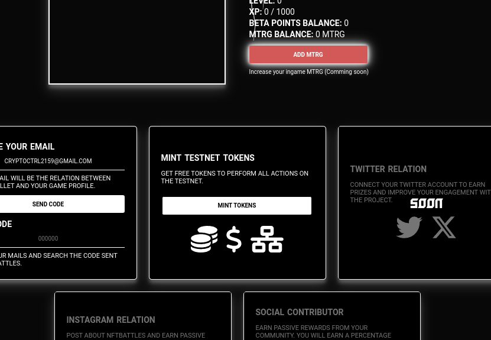
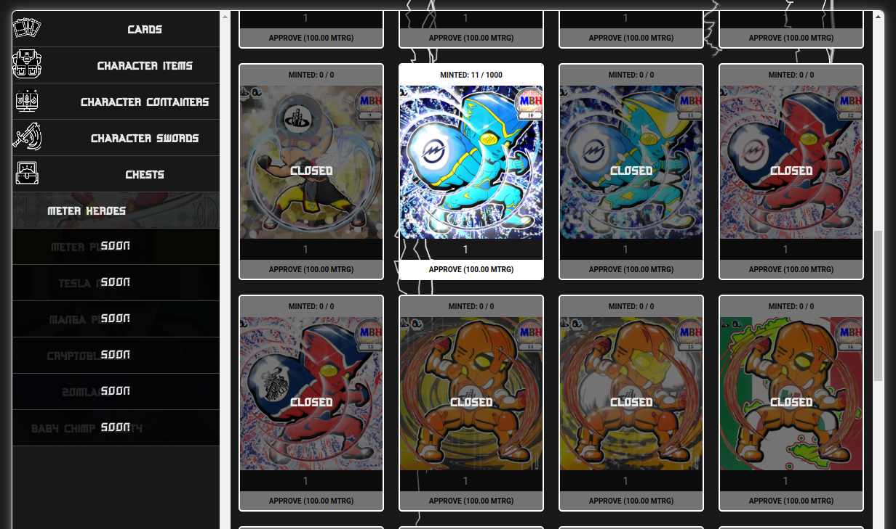
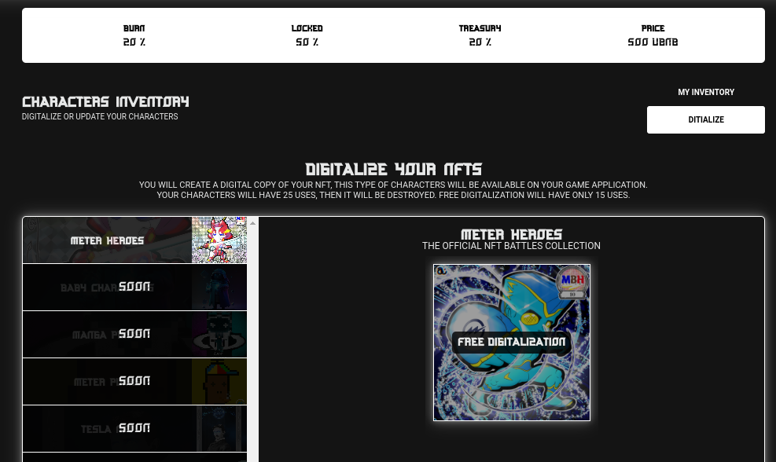
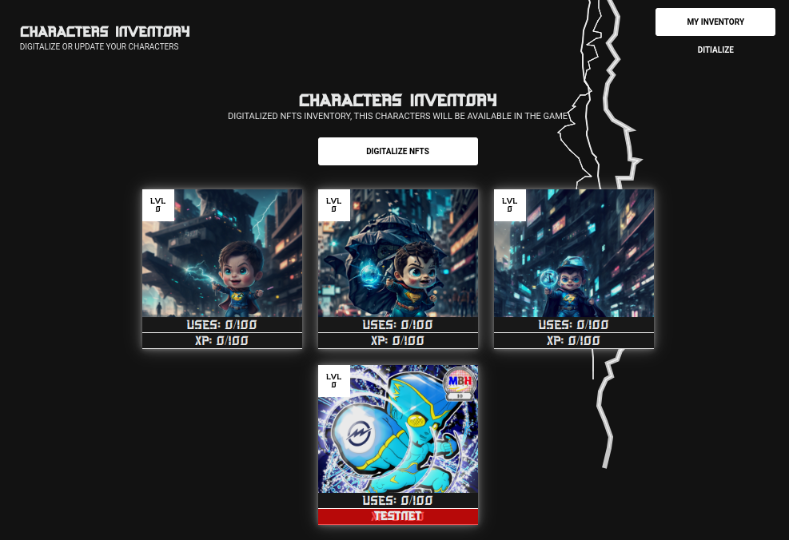
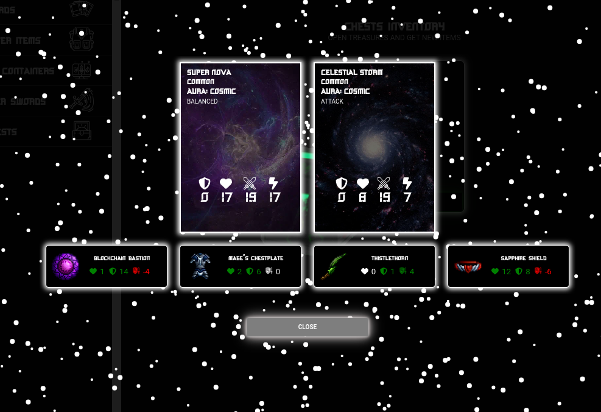

[![MIT License][license-shield]][license-url]

<!-- PROJECT LOGO -->
 

  

  <h3 align="center">NFTBattles Getting started</h3>

  

    Find how to use our main DAPPs.
     
     
     
  

  
Table of Contents

  <ol>
    <li>
      <a href="#about-the-project">About The Project</a>
      <ul>
        <li><a href="#built-with">Built With</a></li>
      </ul>
    </li>
    <li>
      <a href="#getting-started">Getting Started</a>
      <ul>
        <li><a href="#prerequisites">Prerequisites</a></li>
        <li><a href="#prerequisites">Using the web DAPPs</a></li>
      </ul>
    </li>
    <li><a href="#roadmap">Roadmap</a></li>
    <li><a href="#license">License</a></li>
    <li><a href="#contact">Contact</a></li>
  </ol>

<!-- ABOUT THE PROJECT -->
## About The Project

**Note: All the contracts that you'll utilize within the DAPP are open source and can be found in this repository.**
**Note: The contracts and the tutorial is only related with the Web DAPP, the game aplications development will be private to secure our develoipment rights also the contracts related to the application will be open source and will have a reveal when we finish it.**

NFTBattles is a real-time multiplayer game that allows users to battle each other using their own NFTs. The game is currently in beta testing and is free to download.

To play NFTBattles, you will need to collect a team of NFTs. These NFTs can be anything from digital creatures to weapons to spells. Once you have a team, you can challenge other players to battle. Battles are fought in a turn-based format, and the player who wins the most battles will be the champion.

In addition to battling other players, you can also collect rewards in NFTBattles. These rewards can be used to purchase new NFTs, upgrade your existing NFTs, or enter tournaments.

NFTBattles is a fun and challenging game that allows you to use your own NFTs to battle other players. If you are interested in playing NFTBattles, you can download the game from the official website.

Here are some additional details that you may want to include in your introduction:

- The game is set in a fantasy world with a variety of different environments.
- Battles are fought in a turn-based format, with each player taking turns to attack and defend.
- Players can use a variety of different strategies to win battles, including using their NFTs' abilities, positioning their NFTs strategically, and using the environment to their advantage.
- Players can earn rewards in the form of tokens, which can be used to purchase new NFTs, upgrade existing NFTs, or enter tournaments.
- The game is free to play, but there are also in-game purchases available for players who want to progress faster.

(<a href="#readme-top">back to top</a>)

### Built With

[![Next][Next.js]][Next-url]
[![React][React.js]][React-url]
[![Vite][Vite.js]][Vite-url]
[![NodeJS][Node.js]][Node-url]
[![Unity][Unity]][Unity-url]

(<a href="#readme-top">back to top</a>)

<!-- GETTING STARTED -->
## Getting Started

This is an example about how you can get your first character and your first items on web DAPP. With the character and the items you can create your first team to be ready for the battles and join to the game.

The example will be execute on the OpBNB testnet network so you can't use the character and the items on the Mainnets. 

### Prerequisites

- First of all you new a ETH wallet installed on your browser. You can download [https://metamask.io](https://metamask.io) on your favorite wallet....  

- You will need tBNB on the opBNB network, go to the BNB Network faucet to get it [https://testnet.bnbchain.org/faucet-smart](https://testnet.bnbchain.org/faucet-smart) then go to the bridge and deposit it, you will get your testnet tokens on 5 minutes [https://opbnb-testnet-bridge.bnbchain.org/deposit](https://opbnb-testnet-bridge.bnbchain.org/deposit)

- Also you will need uBNB to mint crates, digitalize NFTs and perform all the actions of the testnet DAPP. Go to our web page [https://nftbattles.businessbuilders.city](https://nftbattles.businessbuilders.city), connect your wallet and go to the user profile, if you dont have it create one using your email and your wallet and then you will find the testnet minter.

#### Now you are ready

### Mint your first NFT

You will be able to use all the NFTs on the network so when we deploy it on the mainnet you can use your own NFTs instead of a minted one. But you must do it on the testnet.

**Note: You can jump all this steps while we are on the tests stage, only download the game and use the base character to see the virtual map. Only follow this steps if you want to try the chest opening, character generation and all the DAPP systems.**

1. Go to the items marketplace: [https://nftbattles.businessbuilders.city/marketplace](https://nftbattles.businessbuilders.city/marketplace), you can mint Meter Heroes on this web page using the testnet token. CLick on the Meter heroes section and then approve the testnet tokens and then only click on mint. You will get your NFT when the transaction finish.

2. If you already have NFTs on the testnet you can digitalize it to get you gamified characters. Go to the characters web page [https://nftbattles.businessbuilders.city/characters](https://nftbattles.businessbuilders.city/characters) and digitalize your minted NFT. Click on free digitalization and when the transaction is completed you will have your gamefied character on your inventory.

2. You will see something like this. A testnet character in your inventory.

3. Now your characters need items and cards to play on the game. Go to the items store to buy some treasure chests. [https://nftbattles.businessbuilders.city/marketplace](https://nftbattles.businessbuilders.city/marketplace) Click on chests and then approve and generate one treasure chest. 

4. If the generation transaction was completed you will have the treasure chest in your inventory. Go to your items inventory and open the treasure chest. [https://nftbattles.businessbuilders.city/inventory](https://nftbattles.businessbuilders.city/inventory). Click on open and you will see something like this.

5. Now you have cards, items and characters. You can download the game to start playing with your friends.

<!-- ROADMAP -->
## Roadmap

- [x] Launch our scalable web DAPP to Mint, digitalize and open treasure chest.
- [x] Join to hackathons.
- [x] Create our game prototype.
- [ ] Open the game for our early investors.
- [ ] Launch the project on a big launchpad.

<!--Deployed contracts-->

##Deployed contracts

### OPBNB

- Digitalization controller:
- Digitalization Storage:
- Crate digitalizator:

(<a href="#readme-top">back to top</a>)

<!-- LICENSE -->
## License

Distributed under the MIT License. See `LICENSE.txt` for more information.

(<a href="#readme-top">back to top</a>)

<!-- CONTACT -->
## Contact

BusinessBuilders admin - admin@businessbuilders.city

Twitter - [@nftbbuilders](https://twitter.com/nftbbuilders) - 

Project Link: [nftbattles.businessbuilders.city](https://nftbattles.businessbuilders.city)

(<a href="#readme-top">back to top</a>)

<!-- MARKDOWN LINKS & IMAGES -->
<!-- https://www.markdownguide.org/basic-syntax/#reference-style-links -->
[contributors-shield]: https://img.shields.io/github/contributors/othneildrew/Best-README-Template.svg?style=for-the-badge
[contributors-url]: https://github.com/othneildrew/Best-README-Template/graphs/contributors
[forks-shield]: https://img.shields.io/github/forks/othneildrew/Best-README-Template.svg?style=for-the-badge
[forks-url]: https://github.com/othneildrew/Best-README-Template/network/members
[stars-shield]: https://img.shields.io/github/stars/othneildrew/Best-README-Template.svg?style=for-the-badge
[stars-url]: https://github.com/othneildrew/Best-README-Template/stargazers
[issues-shield]: https://img.shields.io/github/issues/othneildrew/Best-README-Template.svg?style=for-the-badge
[issues-url]: https://github.com/othneildrew/Best-README-Template/issues
[license-shield]: https://img.shields.io/github/license/othneildrew/Best-README-Template.svg?style=for-the-badge
[license-url]: https://github.com/othneildrew/Best-README-Template/blob/master/LICENSE.txt
[linkedin-shield]: https://img.shields.io/badge/-LinkedIn-black.svg?style=for-the-badge&logo=linkedin&colorB=555
[linkedin-url]: https://linkedin.com/in/othneildrew
[product-screenshot]: images/screenshot.png

[Next.js]: https://img.shields.io/badge/next.js-20232A?style=for-the-badge&logo=nextdotjs&logoColor=2EF322
[Next-url]: https://nextjs.org/

[React.js]: https://img.shields.io/badge/React-20232A?style=for-the-badge&logo=react&logoColor=2EF322
[React-url]: https://reactjs.org/

[Vite.js]: https://img.shields.io/badge/Vite-20232A?style=for-the-badge&logo=vite&logoColor=2EF322
[Vite-url]: https://vitejs.dev/guide/features.html

[Node.js]: https://img.shields.io/badge/Node-20232A?style=for-the-badge&logo=node.js&logoColor=2EF322
[Node-url]: https://nodejs.org/en

[Unity]: https://img.shields.io/badge/Unity-20232A?style=for-the-badge&logo=unity&logoColor=2EF322
[Unity-url]: https://unity.com

[Metamask]: https://img.shields.io/badge/Metamask-20232A?style=for-the-badge&logo=metamask&logoColor=2EF322
[Metamask-url]: https://metamask.io/
